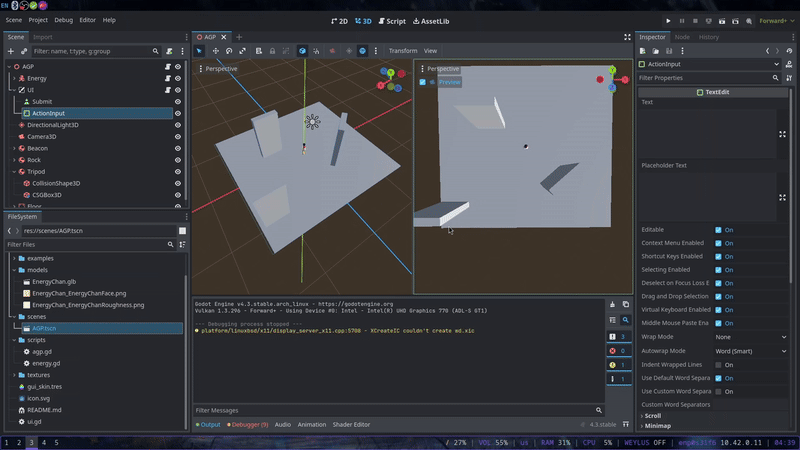

# Action-Gen Playground.
A playground for testing of 3D AI movement in Godot Engine.

## Purpose
This is just a playground to test implemention of action gen in Energy-Chan prior to her release.

## To be implemented:
- Method 1: Action Sequence Generation Composition (ATHR)
- Method 2: CLoSeD (NVIDIA)